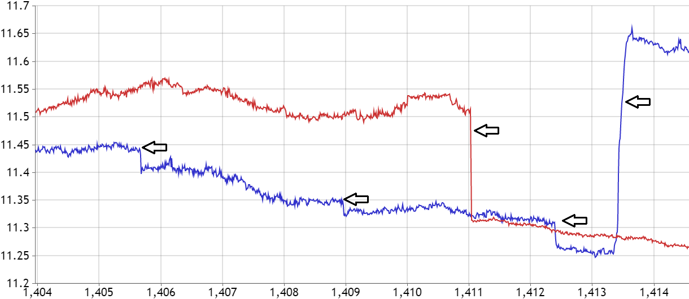

As part of the ACORES project (short for ‘Azores stratoCumulus measurements Of Radiation, turbulEnce and aeroSols’ - catchy, right?), supervised by prof. Szymon Malinowski, I wrote my Bachelor's Thesis at University of Warsaw.

They were testing a new ultrafast thermometer and noticed a certain type of anomalies that occurred frequently in the collected data. They were somewhat hard to define in a programmatic way, but as they say, you know it when you see it.

<!-- An example of one of the types of jumps in the dataset. -->

At the time, I was looking for a thesis project where I could use Machine Learning in some way, so -- let's try! I spent a full day rewatching Netflix shows and clicking through a self-written web app to label the dataset (the alternative was printing it out on a couple hundred pages... yea, let's not), and thus I obtained my dataset.

From that point, the Machine Learning began. For my thesis, I rigorously defined the classification problem and the fundamentals of Machine Learning (it was still a Physics degree, after all), and performed experiments with several models, both "classical" ML, and NN-based ones. Unsurprisingly, recurrent models like GRU and LSTM exhibited the best performance, confirming the applicability of ML for this task - and quite possibly pointed out a few errors I had made while preparing the dataset.