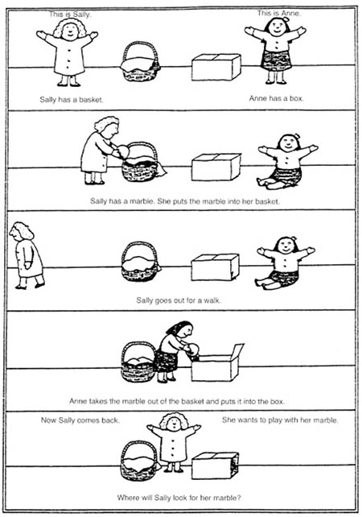

My Master's Thesis was done at Aalto University, supervised by Alexander Ilin and advised by Antti Keurulainen from Bitville Oy. 

The inspiration of this research was the concept of Theory of Mind, taken from developmental psychology. The main experiment used for showcasing ToM capabilities is the so-called Sally-Anne experiment:

There are three characters involved: Sally, Anne, and the Observer whose ToM capabilities we wish to test. Sally and Anne are in a room with a box, a basket and a marble. Sally puts the marble in the basket, and then goes out of the room for a brief walk. In her absence, Anne moves the marble to the b ox. Now, Sally comes back, and the question to the Observer arises - where will Sally look for the marble?

As (presumably) an adult human, the dear reader should know the answer is the basket -- she has no knowledge that would indicate it being elsewhere. However, a naive observer (like a very young child or some animals) could answer with the box instead -- the marble is there, after all. The difference between these two answers lies in the ability to "put yourself in someone else's shoes", to reason about what someone else knows rather than using only our (perhaps superior) knowledge. In their paper [Machine Theory of Mind](https://arxiv.org/abs/1802.07740), Rabinowitz et al. show that this is, in fact, possible to create in RL-based AI systems. 

Now let's focus our attention on one specific type of ToM -- skill modeling. Can we build an agent that will accurately predict the skill level of another agent acting in the same environment, and adjust its actions accordingly? This is the question I explored in my thesis, and the answer is a resounding "maybe".

I coded up an environment using [pycolab](https://github.com/deepmind/pycolab) with a gym-like multiagent API and began the experiments.

The basic idea of the environment is as follows: on a 7x7 gridworld, there are 2 agents, 4 subgoals and a final goal. Agents can move up/down/right/left at each step, and whenever they move onto a subgoal, it's marked as collected. Once all subgoals are collected, the final goal becomes available, and once it's collected, the episode ends. The environment is fully cooperative, which means that all the rewards (obtained by collecting subgoals and the final goal) are shared between the agents.

That is the base setting, at least. In the meantime, I added some simplified variants, like the Final Action environment in which there is an [Assurance Game](https://wiki.p2pfoundation.net/Assurance_Game) embedded at the end of an episode to put a larger emphasis on the cooperation aspect of the environment.

For further details -- feel free to read the full pdf version of my thesis available at the top of this page.